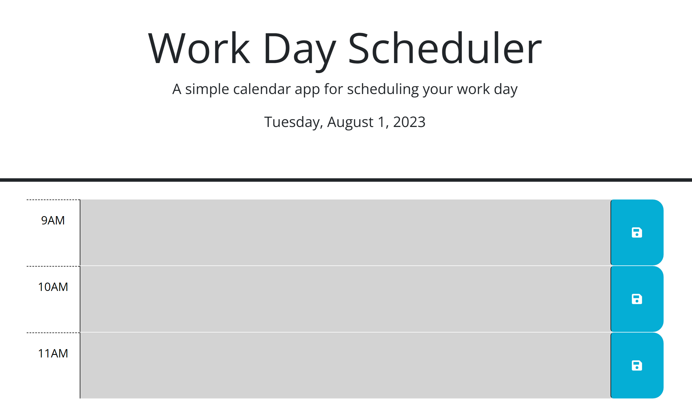

# Workday Scheduler
Web API Challenge: Workday Planner! 

## Description

This simple web app was designed to help an employee better manage their working hours with a straightforward, color coded planner. This project was an excellent way to challenge and expand my knowledge of third-party APIs such as Day.js, Jquery UI and Bootstrap! 

## Installation
N/A 

## Usage 

Open <a href="https://abbyjo.github.io/c5-workday-sched/">this link</a> in your favorite browser to use this planner today! 
Upon opening the page, you'll be presented with blocks of time for each hour in a typical 9AM - 5PM work day. If you click within each block, you'll be able to input relevant events as you wish. To save these events simply click the save icon on the right! A message will display up top informing you that your event has been saved allowing you to refresh and/or reopen the page and see your schedule as you wish. 
 
  

## Credits 

The starter code for this project was provided by UCF/EdX. 
I recieved help with the function to display saved events in each time block from TA, Ali Rahimlou!  

## License
N/A
